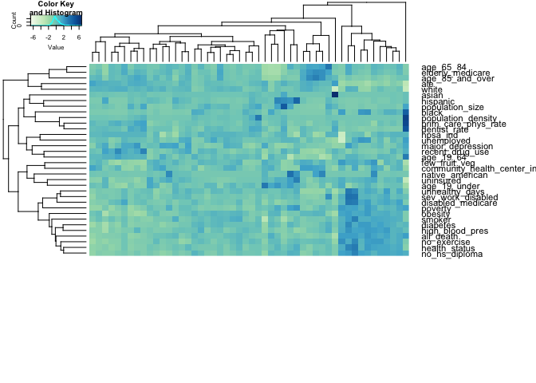
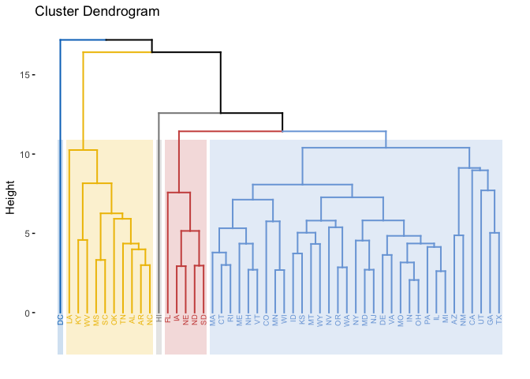

Unsupervised
================
Shuwei Liu

``` r
data = read_csv("./data/dataset.final.csv") %>% 
  select(-X1, -county_name) %>% 
  select(state_abbr, everything()) %>% 
  na.omit() %>% 
  group_by(state_abbr) %>% 
  summarise_all(funs(mean))
```

    ## Warning: Missing column names filled in: 'X1' [1]

    ## Parsed with column specification:
    ## cols(
    ##   .default = col_double(),
    ##   county_name = col_character(),
    ##   state_abbr = col_character()
    ## )

    ## See spec(...) for full column specifications.

    ## Warning: funs() is soft deprecated as of dplyr 0.8.0
    ## please use list() instead
    ## 
    ## # Before:
    ## funs(name = f(.)
    ## 
    ## # After: 
    ## list(name = ~f(.))
    ## This warning is displayed once per session.

``` r
dat1 <- data[,2:35]
dat1 <- scale(dat1)
rownames(dat1) <- data$state_abbr
```

``` r
col1 <- colorRampPalette(brewer.pal(9, "GnBu"))(100)
col2 <- colorRampPalette(brewer.pal(3, "Spectral"))(2)

heatmap.2(t(dat1), 
          col = col1, keysize=.8, key.par = list(cex=.5),
          trace = "none", key = TRUE, cexCol = 0.75, 
          labCol = as.character(data$county_name),
          margins = c(10, 10))
```

    ## Warning: Unknown or uninitialised column: 'county_name'.

<!-- -->

``` r
hc.complete <- hclust(dist(dat1), method = "complete")
```

``` r
fviz_dend(hc.complete, k = 5,        
          cex = 0.5, 
          palette = "jco", 
          color_labels_by_k = TRUE,
          rect = TRUE, rect_fill = TRUE, rect_border = "jco")
```

<!-- -->
